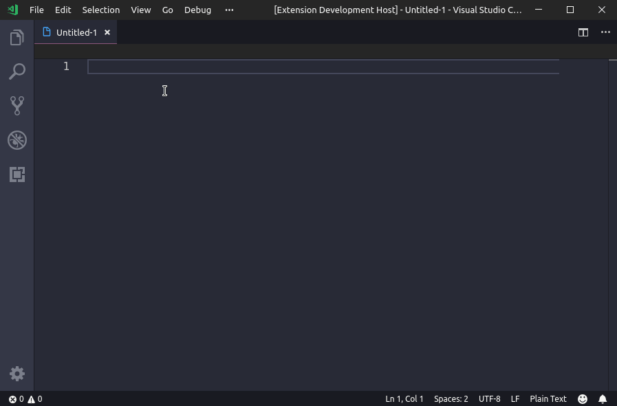
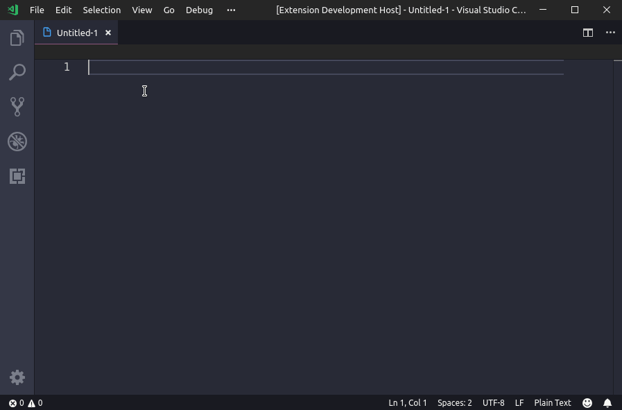
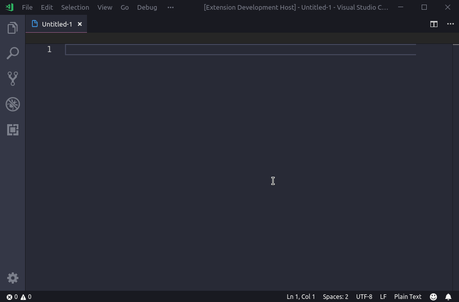
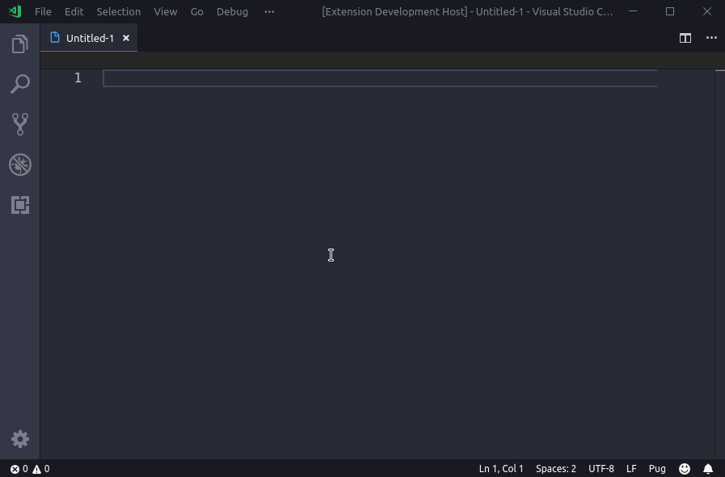

# vscode-fish-text

_This package is more useful for russian speaking users. Basically, it adds a russian alternative of "lorem ipsum" based on universal speech code (see the image below)._

Этот пакет позволит прямо в редакторе добавить "рыбный" текст, составленный по универсальному коду речей.

## Как пользоваться?

Используйте сниппеты `рыба` и `fish`. Они добавляют текст из трёх предложений.

Также в конце сниппета `рыба`/`fish` добавить число предложений, которое нужно добавить.

Для языков, где используются HTML-теги, доступны сниппеты `рыбатег` и `fishtag`, которые добавляют текст, завёрнутым в HTML-тег на выбор (по умолчанию - `
`).

Вышеописанное также работает в Pug (Jade).

## А зачем?

Данный плагин будет полезен верстальщикам, которым нужно быстро откуда-то достать стенку текста *на кириллице* (пусть и бессмысленного). Русский текст на русскоязычных сайтах смотрится куда более органично.

Кстати, для Atom Editor есть [аналогичный плагин](https://atom.io/packages/fish-text).

## Что это за магия? Почему такой складный текст?

## LICENSE

[MIT](LICENSE.md)
